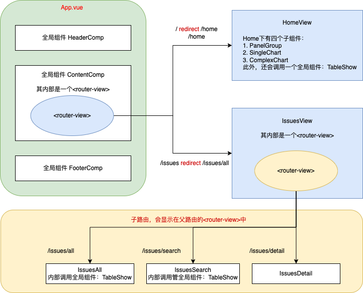

# 简介

本科毕设前端，基于 Vue3 + Element Plus + Echarts。

# 快速使用

```shell
# 基于 package.json 安装依赖
yarn install

# 启动服务
yarn serve

# 构建服务
yarn build

# 检查项目代码是否符合规范
yarn lint

# 查看默认配置
vue inspect > output.js
```

More See [Configuration Reference](https://cli.vuejs.org/config/).

# 开发笔记

## 安装依赖

```shell
yarn add vue-router@4
yarn add vuex@next --save
yarn add axios

# element-plus自动导入还需要安装并配置一些东西，详见官网
yarn add element-plus

# 安装到测试环境
yarn add svg-sprite-loader -D

# vue-count-to 在vue3无法使用，在issue里看到别人打包的v3版本
yarn add vue-countup-v3
```

安装后的依赖在`package.json`中可以看到。

## 文件夹解析

src 中存在如下文件夹：

- api：axios，使用 ajax 请求后端的 api。包装一个`request.js`，设置响应拦截等。
- assets：静态文件
- components：组件，存放.vue 文件，一般存放全局组件。我们在`main.js`导入，并`app.component()`将其全局注册，此后可直接在 template 中以 <组件名/>的方式调用，无需在单独导入。
- composables：响应式 api 单独抽离出来的逻辑，方便逻辑复用。命名上一般以 use 开头。vue3.0 引入，[参见](https://v3.cn.vuejs.org/guide/composition-api-introduction.html)
- router：路由的信息
- store：vuex，实现组件间数据共享。[vuex 项目架构](https://vuex.vuejs.org/zh/guide/structure.html)
- views：同样存放.vue 文件，不同的是这里的文件都充当视图的作用，即会被路由，称为路由组件。如 about.vue，会路由到：/about。也有人将其命名为 pages。

## 开发前设置

### @/_->src/_

设置 jsconfig.json，脚手架已经默认设置。可以用@符号代指 src 目录。

### 关闭 eslint

```JavaScript
lintOnSave: false
```

# 项目分析



全局组件：

- Header：放一个搜索框,点击时跳转到搜索 /issues/search
- Content：存放主要内容，其中有个`<router-view/>`
- Footer

路由组件：路由组件的内容会最终显示在 Content 的`<router-view/>`中。

- Home：显示统计信息
  - 第一行 @Home/components/PanelGroup.vue
    - 研究的数据库类型 HDFS
    - issue 的时间跨度 19/03/30 - 22/03/01
    - issue 数量 477
    - 最后更新时间
  - 第二行：echart 可视化数据
    - 左侧：SingleChart
    - 右侧：ComplexChart
  - 第三行：TableShow
- Issues：存放路由`<router-view/>`，其下三个子路由的内容会显示在这里。

# 后端接口

后端的接口运行在：`http://localhost:8081/hdfsbugdb-server/api`上，前端运行在`8080`端口，因此需要解决跨域问题：`vue.config.js`文件中，添加`devServer`，具体配置见代码。

# 技巧

## echarts

### echarts 官网的示例代码

根据官网的示例代码，我们需要先引入 echarts，然后通过 id 获取 DOM 来初始化。

```javascript
<template>
  <div ref="myChart" id="myDiv></div>
</template>
<script>
import * as echarts from "echarts";
export default{
  mounted(){
      let chartDom = document.getElementById("main");
      let myChart = echarts.init(chartDom);
  }
}
</script>
```

### 全局引入

如果每次使用 echart ，都需要引入 echart 就很麻烦，应该全局引入。

vue3 和 vue2 不同，vue2 中将 echarts 放到原型链中，但 vue3 无法这么做。

但 vue3 提供了 `provide` 和 `inject`。

在 `App.vue` 中使用 `provide` 为后代们提供数据。

```javascript
<script>
import { provide } from "vue";
import * as echarts from "echarts";
import axios from "axios";
export default {
  name: "App",
  setup() {
    provide("echarts", echarts);
    provide("axios", axios);
  },
};
</script>
```

然后在需要使用 echarts 的子组件中，使用 `inject` 接收导入的 echarts。通常我们将其放入 `$echarts` 变量中。

```javascript
<script>
import {inject} from "vue"
export default {
  setup(){
    let $echarts = inject("echarts");
  }
}
</script>
```

### vue 中优化后的代码

此外，在 vue 中我们不应该直接操作 DOM，因此更好的办法是使用 vue 的 `ref` 。

```javascript
<div ref="myChart" id="myDiv></div>
let myEcharts = $echarts.init(this.$refs.myChart);
```

此处是我们已经通过 `inject` 引入了 echarts，并用 `$echarts` 这个变量接受了它，然后调用它的 `init` 方法，该方法需要传入一个 `dom` 节点，作为绘图的容器。我们用 `ref` 获取该容器，将其传进去。效果是和上面的 `getElementById()` 方法一样的。

### vue setup 中使用 ref

`setup` 是 vue3 中的新特性，在 `setup` 中是无法使用 this 的，因此也无法获取 `this.$refs` 。
此时需要引入 vue3 中新的响应式函数 `ref()` ，这个函数时可以让一个变量变为响应式。

理论上来说，他和 DOM 引用的 `ref` 属性是没啥关系的，但当 `ref()` 中传入 `null` 或 `空值` ，**并且** 接受变量的变量名(如 refDom)等于 `ref` 属性的 `值` 的时候，可以通过 `refDom.value` 来获取 dom 对象。

还有一个注意点，refDom 需要在 setup 中返回。

```
<template>
<div ref="myChart" id="myDiv></div>
</template>
```

```javascript
<script>
  import { inject, ref, onMounted } from "vue";
  export default{
    setup() {
    let $echarts = inject("echarts");
    onMounted(() => {
      let $echarts = inject("echarts");

      // let myEcharts = $echarts.init(this.$refs.myChart);  //setup中无法使用
      const myChart = ref();  // 变量名的值 需要与 ref 的属性值相同
      let Chart = $echarts.init(myChart.value);
      let option = {
          ...
      };
      Chart.setOption(option);

      // 返回变量名
      return { myChart }
  }
</script>
```

### 组件式编程优雅使用 echart

建立一个新的文件 `composables/useEcharts.js`，该文件对外暴露一个方法：`useEcharts(option,domid)` ，此后我们在组件中，只需要导入该文件，直接使用该方法，传入 `option` 和 `domid` 即可。

### echarts 常用配置

- xAxis
- yAxis
- grid：直角坐标系内绘图网格
- tooltip：提示框组件。当你滑到相应位置的时候显示内容
- legend：图例组件

## svg 优雅使用

1. 最原始的 icon 使用方式 直接嵌入 svg 代码

2. [svg-sprite-loader](https://github.com/JetBrains/svg-sprite-loader)

```JavaScript
/* vue.config.js */
const path = require("path");
// 定义resolve方法，获取绝对路径
function resolve(dir) {
  return path.join(__dirname, dir);
}
module.exports = defineConfig({
    chainWebpack: (config) => {
    // 配置svg默认规则排除icons目录中svg文件处理
    config.module.rule("svg").exclude.add(resolve("src/icons")).end();

    // 新增icons规则，设置svg-sprite-loader处理icons目录中svg文件
    config.module
      .rule("icons")
      .test(/\.svg$/)
      .include.add(resolve("src/icons"))
      .end()
      .use("svg-sprite-loader")
      .loader("svg-sprite-loader")
      .options({ symbolId: "icon-[name]" })
      .end();
  },
})
```

配置完后，在 `main.js` 中导入 svg 即可使用

```html
// main.js import "@/icons/svg/bug.svg"; //
<template>
  <svg>
    <use xlink:href="#icon-bug"></use></svg
  >;</template
>
```

但是这样做还需要每次都引入，很麻烦。因此我们抽象出一个全局组件： `@components/SygIcon/index.vue`
其中将使用逻辑抽象了出来，并进行了一些计算属性的操作。

```html
<template>
  <svg :class="svgClass" aria-hidden="true">
    <use :xlink:href="iconName" />
  </svg>
</template>
export default { name: "SvgIcon", }
```

并且在 `@icons/index.js`中书写引入逻辑，只需要在 `main.js` 中导入该文件，以后就无需每次都导入 svg 了。
最终使用时，只需要如此：

```html
<template>
  <svg-icon icon-class="qq" class-name="qq-style"></svg-icon>
</template>
```

其中 icon-class 传入你的 svg 文件名，class-name 传入你想写给这个 svg 的样式。
